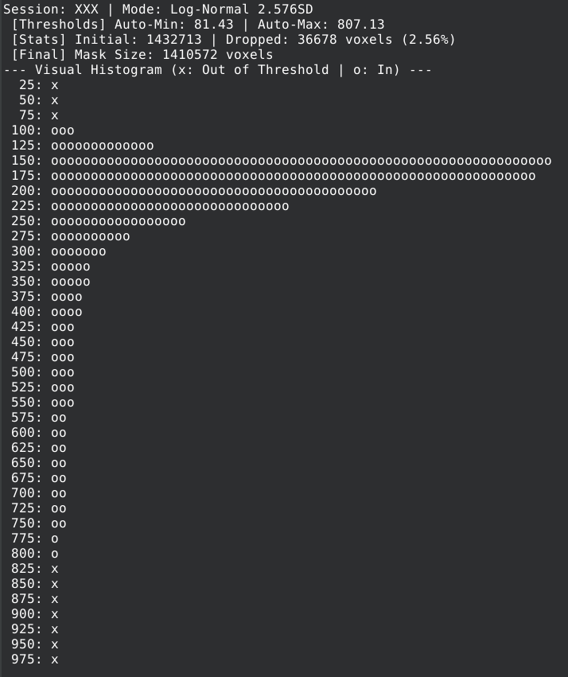
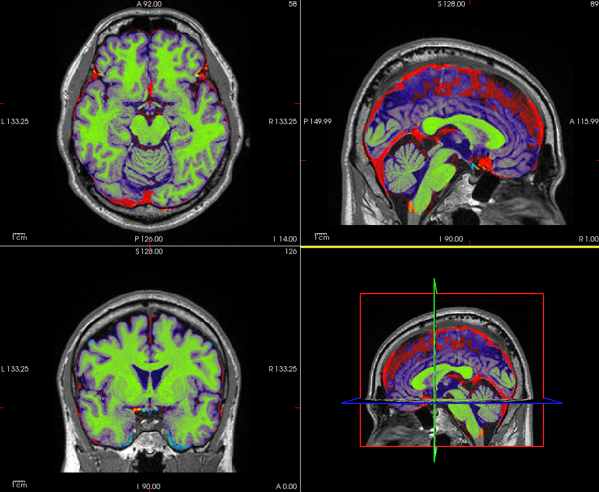

# t2log-strip

This tool provides robust brain extraction for T2-weighted images by leveraging `mri_synthstrip` with log-transformation and statistical standardization preprocessing.

## Overview
Brain extraction on T2 images is often compromised by high-intensity signals from non-brain tissues and geometric distortions. This tool stabilizes the input for `mri_synthstrip` through robust scaling, ensuring reliable results.

**Hardware Recommendation:**
The use of a **16-channel head coil** is recommended. This setup typically exhibits fewer distortions in areas prone to susceptibility artifacts, such as the **Orbitofrontal Cortex (OFC)** and **Temporal Pole (TP)**, which is essential for accurate skull stripping in T2-weighted scans.

## Optimization Workflow
Parameters should be adjusted by inspecting the **histogram provided in each subject's individual log**.

### 1. Initial `-b` Selection (Start with 1)
The `-b` option (outlier threshold) in `mri_synthstrip` is the first parameter to test:
- **First choice**: Start with **`-b 1`** for a tighter extraction.
- **Adjustment**: If the **per-subject log** or result shows over-stripping, switch to **`-b 2`** to preserve more boundary tissue.

### 2. Fine-tuning with Confidence Intervals (CI / SD)
Once `-b` is determined, use the **histogram in the individual subject's log** to finely tune the Standardization threshold.

- **Goal**: Ensure the brain signal is correctly mapped, typically residing within the **second cluster (layer) from the lowest intensity** in the histogram.
- **Adjustment Guide**: 
    - **95% CI (approx. 1.960 SD)**: The standard starting point.
    - **99% CI (approx. 2.576 SD)**: Use this if brain parenchyma is still being removed at 95%.
    - *Other values (e.g., 97.5% / 2.241 SD) can be used for precise control.*

> **Key Tip:** Prioritize "no over-stripping." Refer to the **histogram in the subject-specific log** and adjust the CI/SD threshold until the brain tissue is stably positioned in the second intensity layer.

## 📂 HCP Pipeline Integration
This tool is designed to follow the initial steps of `PreFreeSurferPipeline.sh`.

- **Strategy**: Replaces conservative FSL-BET with a high-fidelity mask that effectively strips persistent non-brain tissues (e.g., **dura and venous sinuses**) while simultaneously **restoring** previously over-stripped brain regions. This eliminates the need for excessive "safety margins" and provides a refined starting point for surface reconstruction.
- **Note**: To fully leverage the potential of this high-fidelity mask, the FreeSurfer process (e.g., `recon-all`) should be appropriately tuned or customized to align with the refined brain-surface input.

## ⚙️ Configuration & Usage
Edit `t2log-strip.sh` to match your environment:
```bash
Subjlist="001 002 003"            # Subject IDs
BASE_PATH="/path/to/project"      # Project root
```

## 🔄 Recovery & Undo Process
If you need to revert changes or test different parameters, use the provided recovery script:

```bash
chmod +x recover_t2ls.sh
./recover_t2ls.sh
```

> [!IMPORTANT]
> - **Configuration**: Ensure `Subjlist` and `BASE_PATH` in `recover_t2ls.sh` match your environment.
> - **Restoration**: Restores original files from the `*_bet.nii.gz` backups created during the initial run.
> - **Clean Start**: Highly recommended to run this recovery script before re-running `t2log-strip.sh` with new parameters.

## 🔬 Methodology: Log-Normal Adaptive Thresholding
While `mri_synthstrip` is robust, applying a T2w-derived mask directly can often capture unwanted non-brain structures due to T2w-specific signal profiles. This tool adds a statistical optimization layer to solve this:

- **Log-Normal Analysis**: Analyzes voxel intensities in log-space for superior tissue characterization, specifically targeting the intensity distribution of the T2w signal.
- **Adaptive Statistical Refinement**: Instead of relying on fixed thresholds, it applies a **1.960 SD (95% CI)** threshold derived from each image's unique distribution to objectively fine-tune boundaries.
- **Dynamic Surface & Cleanup**: Adapts to each scan's intensity profile to prevent over-stripping of the cortical ribbon while effectively stripping persistent outliers like **venous sinuses** and **dura**.
- **Structural Integrity (fillh)**: Finalizes the mask with a **hole-filling (fillh)** process. This prevents potential FreeSurfer errors and surface reconstruction artifacts caused by internal mask voids, ensuring a topologically sound input for `recon-all`.


## 📊 Visual Proof: Precision Comparison


- **Background**: `T1w_acpc_dc_restore`
- **Red**: Extraneous non-brain tissue (e.g., **venous sinuses** and **dura**) captured by FSL-BET but **successfully excluded** by t2log-strip.
- **Cyan**: **Restored** brain regions that were previously over-stripped by standard methods.
- **Purple&Green**: **Overlap** where both masks align.

To reproduce this view with **Freeview**, use the provided viewer script:
```bash
# Setup: Set your HCP directory in BASE_PATH within the script.
./fview_t2ls.sh [Subject_ID]
```

## 🛠 Prerequisites
Ensure these are in your `$PATH`:
- **FSL 6.0.7**
- **FreeSurfer 7.4.1** (`mri_synthstrip`)
- **bc** (GNU calculator)

