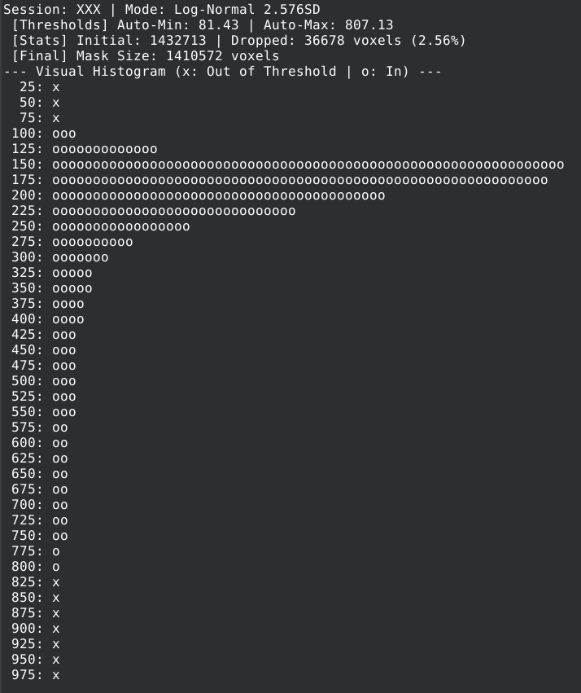
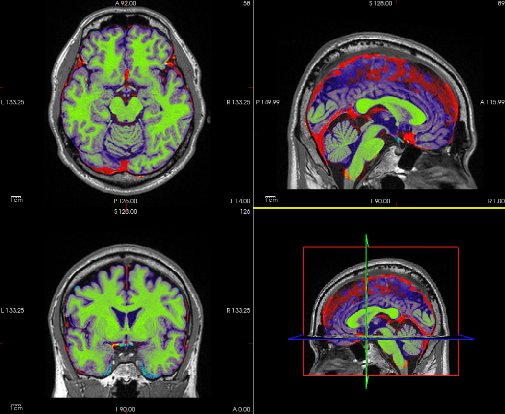

# t2log-strip

This tool provides robust T2-weighted brain extraction using FreeSurfer’s `mri_synthstrip`, enhanced with log-transformation and statistical thresholding.

---

## Overview

Following SynthStrip brain extraction, t2log-strip applies log-transformation and statistical thresholding to the T2w image to further remove residual non-brain signal based on the T2w intensity distribution.

The resulting mask is intended for FastSurfer-based T1w cortical reconstruction within an HCP-style processing workflow and supports practical downstream T1w/T2w-derived myelin mapping.

---

## Protocol-specific parameter setting

Masking parameters are determined for each imaging protocol rather than optimized separately for individual subjects. For a new acquisition protocol, intensity histograms and resulting masks are inspected in a small number of representative subjects to identify appropriate values for border_num and SD_FACTOR_T2. Once selected, the same parameter settings are applied to all subjects acquired with that protocol.

Differences in image contrast across acquisition protocols may therefore require separate parameter selection, while subject-by-subject tuning is not part of the intended workflow.

---

## Parameter selection workflow

### 1. Initial `border_num` Selection

In the `# --- Configuration ---` section:

- `border_num=2`: recommended default; provides conservative brain extraction
- `border_num=1`: tighter extraction (use if additional removal of peripheral non-brain tissue is needed)

---

### 2. Protocol-level selection of SD_FACTOR_T2

Use intensity histograms and resulting masks from a small number of representative subjects to confirm an appropriate SD_FACTOR_T2 for the imaging protocol:

- **2 SD**: more aggressive refinement
- **3 SD**: recommended default
- **4 SD**: more conservative refinement (use if brain tissue is removed)

👉 Goal: preserve brain tissue while reducing residual non-brain signal.

> **Tip:** prioritize avoiding over-stripping.

---

## Usage

### 1. Setup

Edit the configuration in `t2log-strip.sh`:

```bash
# --- Configuration ---
Subjlist="001 002 003"
BASE_PATH="/path/to/your/project"
border_num=2
SD_FACTOR_T2=3
```
### 2. Execution

```bash
chmod +x t2log-strip.sh
./t2log-strip.sh
```

### 3. Protocol-level review

Before processing the full cohort:

1. Run t2log-strip on a small number of representative subjects.
2. Review the intensity histograms and resulting masks.
3. Confirm border_num and SD_FACTOR_T2 for the imaging protocol.
4. Apply the selected settings unchanged to all remaining subjects acquired with the same protocol.



- **If the brain is over-stripped**: increase `SD_FACTOR_T2` (e.g., from 3 SD to 4 SD)
- **If residual non-brain tissue remains**: decrease `SD_FACTOR_T2` (e.g., from 3 SD to 2 SD)

> **Tip:** Start with the recommended default of 3 SD and prioritize avoiding over-stripping.

## Recovery

```bash
chmod +x recover_t2ls.sh
./recover_t2ls.sh
```

- Restores original files from `_bet.nii.gz`
- Recommended before re-running with new parameters

---

## HCP Integration

Designed for HCP pipeline structure:

- Updates T1w and T2w brain images
- Synchronizes masks to MNINonLinear space
- Applies transforms automatically
- Creates backups before modification

---

## QA & Reporting

A summary CSV (`hss_t2ls_summary_*.csv`) is generated:

- intensity thresholds
- SD factors
- voxel drop rates

👉 Useful for cohort-level QA.

---

## Visual Comparison



- **Red**: non-brain tissue removed
- **Cyan**: restored brain regions
- **Overlap**: agreement

---

## Viewer

```bash
./fview_t2ls.sh [Subject_ID]
```

## Prerequisites

Ensure the following are available in your `$PATH`:

- FSL 6.0.7  
- FreeSurfer 7.4.1 (`mri_synthstrip`)  
- bc (GNU calculator)

## Citation

Hatano, K. (2026). *t2log-strip* (Version 3.12), a T2w-based log-transformed masking tool [Software]. GitHub. https://github.com/koji-hatano1/t2log-strip
